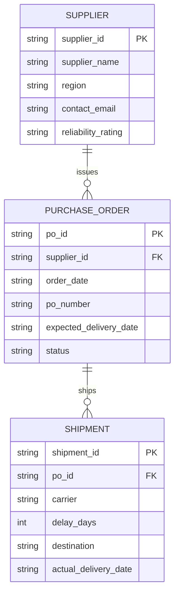

# Day 2 — Entity Relationship Diagram

## Entity dictionary
- **Supplier**: a vendor company that fulfills purchase orders for goods.
- **Purchase Order**: a formal order placed with a supplier for a batch of goods.
- **Shipment**: a physical movement of goods against a purchase order, tracked by carrier and delay.
